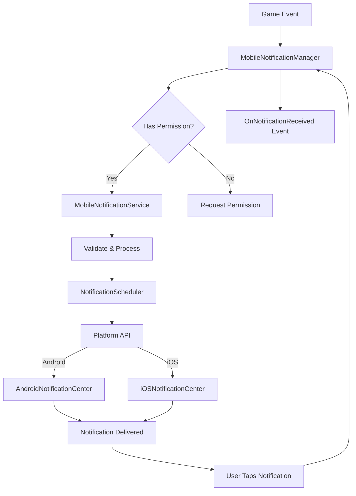

# 🔔 Mobile Notifications System

> 💡 **Hệ thống notification đa nền tảng cho Unity mobile games với khả năng schedule scenarios và checkpoint-based timing**

---

## 📖 Tổng Quan

Hệ thống Mobile Notifications cung cấp một giải pháp hoàn chỉnh để quản lý push notifications trên cả Android và iOS. Được thiết kế để **dễ sử dụng**, **dễ mở rộng** và có **hiệu suất tối ưu**, hệ thống này cho phép bạn tạo và quản lý notifications theo nhiều cách khác nhau - từ notifications đơn lẻ đến scenarios phức tạp dựa trên checkpoints trong game.

### ⭐ Tính Năng Chính

- ✨ **Cross-Platform Support**: Hoạt động trên cả Android và iOS với cùng một API
- 🔐 **Permission Management**: Tự động hoặc thủ công request quyền notification từ người dùng
- 📅 **Flexible Scheduling**: Schedule notifications đơn lẻ, nhiều notifications, hoặc cả scenarios
- 📍 **Checkpoint-Based Timing**: Tính toán timing dựa trên game checkpoints (level complete, achievement, v.v.)
- 🎯 **Scenario System**: Tạo kịch bản notifications từ trước với ScriptableObjects
- 🔄 **Repeating Notifications**: Hỗ trợ notifications lặp lại với interval tùy chỉnh
- 📬 **Event System**: Events cho permission changes, notification received, và errors
- 🎨 **Customizable**: Badge numbers, icons, categories, custom data cho mỗi notification
- ⚡ **High Performance**: Thiết kế tối ưu với async/await và zero allocation patterns
- 🏗️ **MVP Architecture**: Code được tổ chức theo pattern MVP với separation of concerns rõ ràng

### 🎯 Use Cases Phổ Biến

- 📱 **Daily Login Reminders**: Nhắc người chơi quay lại game hàng ngày
- 🎁 **Reward Notifications**: Thông báo về rewards, gifts, hoặc special offers
- ⚡ **Energy/Lives Refill**: Nhắc khi energy hoặc lives đã refill
- 🏆 **Achievement Unlocks**: Celebrate khi người chơi đạt được achievements
- 🎮 **Engagement Campaigns**: Re-engage người chơi inactive với notification series
- 📅 **Event Announcements**: Thông báo về special events, tournaments, hoặc limited-time offers
- 🎯 **Checkpoint Reminders**: Notifications dựa trên game progress (level complete, tutorial done, v.v.)

### 📋 Prerequisites

- 🔧 Unity version: `2021.3+` (LTS recommended)
- 📦 Required packages: 
  - **Unity Mobile Notifications** (com.unity.mobile.notifications)
  - **UniTask** (com.cysharp.unitask)
- ⚙️ Platform: Android 5.0+ (API 21+), iOS 10.0+

---

## 🏗️ Kiến Trúc Hệ Thống

> 🎨 Hệ thống này tuân theo **MVP (Model-View-Presenter) Pattern** với **Dependency Injection**

### 📂 Cấu Trúc Folders

```
MobileNotifications/
├── 📦 Interfaces/              # Contracts và abstractions
│   ├── IMobileNotificationManager.cs
│   ├── IMobileNotificationService.cs
│   ├── INotificationPermissionHandler.cs
│   └── INotificationScheduler.cs
├── ⚙️ Core/                    # Business logic implementations
│   ├── MobileNotificationManager.cs
│   ├── MobileNotificationService.cs
│   ├── NotificationPermissionHandler.cs
│   └── NotificationScheduler.cs
├── 💾 Data/                    # Data models và configs
│   ├── NotificationData.cs
│   ├── NotificationScenario.cs
│   ├── MobileNotificationConfig.cs
│   └── NotificationChannelData.cs
├── 📖 Examples/                # Code examples và tutorials
│   ├── BasicUsage.cs
│   ├── ScenarioSetup.cs
│   └── CheckpointNotification.cs
└── 📚 README.md               # Documentation này
```

---

### 🔧 Core Components

#### 📦 Interfaces/

> 🎯 **Định nghĩa contracts cho toàn bộ hệ thống**

- 📄 **[`IMobileNotificationManager.cs`](./Interfaces/IMobileNotificationManager.cs)**: Interface chính để quản lý toàn bộ notification system
- 📄 **[`IMobileNotificationService.cs`](./Interfaces/IMobileNotificationService.cs)**: Interface cho business logic và data processing
- 📄 **[`INotificationPermissionHandler.cs`](./Interfaces/INotificationPermissionHandler.cs)**: Interface để xử lý permissions
- 📄 **[`INotificationScheduler.cs`](./Interfaces/INotificationScheduler.cs)**: Interface cho scheduling operations

#### ⚙️ Core/

> 🎯 **Implementations của business logic**

- 📄 **[`MobileNotificationManager.cs`](./Core/MobileNotificationManager.cs)**: MonoBehaviour chính orchestrate tất cả components
- 📄 **[`MobileNotificationService.cs`](./Core/MobileNotificationService.cs)**: Service xử lý validation, scenarios và checkpoints
- 📄 **[`NotificationPermissionHandler.cs`](./Core/NotificationPermissionHandler.cs)**: Handler cho Android/iOS permissions
- 📄 **[`NotificationScheduler.cs`](./Core/NotificationScheduler.cs)**: Scheduler để schedule/cancel notifications cross-platform

> 💡 **Chi tiết architecture**: Xem thêm về data flow tại phần [Data Flow](#-data-flow)

#### 💾 Data/

> 🎯 **Data models và configuration assets**

- 📄 **[`NotificationData.cs`](./Data/NotificationData.cs)**: Serializable model chứa thông tin một notification
- 📄 **[`NotificationScenario.cs`](./Data/NotificationScenario.cs)**: ScriptableObject để định nghĩa kịch bản notifications
- 📄 **[`MobileNotificationConfig.cs`](./Data/MobileNotificationConfig.cs)**: ScriptableObject configuration cho hệ thống
- 📄 **[`NotificationChannelData.cs`](./Data/NotificationChannelData.cs)**: Data cho Android notification channels

---

### 📊 Data Flow



---

## 📖 Hướng Dẫn Sử Dụng

### 🚀 Bắt Đầu Nhanh

> ⏱️ **Thời gian setup**: ~10 phút

#### 1️⃣ Import Package Dependencies

```
📦 Unity Package Manager
├── Window → Package Manager
├── Add package by name...
│   ├── com.unity.mobile.notifications
│   └── com.cysharp.unitask
└── Click "Add"
```

> 💡 **Note**: Đảm bảo cả hai packages đã được import trước khi tiếp tục

#### 2️⃣ Tạo Configuration Asset

```
📁 Project Window
└── Right-click → Create → Foundations → Mobile Notifications → Config
    └── Đặt tên: "MobileNotificationConfig"
```

#### 3️⃣ Configure Settings

> 📄 **Config location**: Recommend đặt tại `Assets/Resources/Configs/`

Mở **MobileNotificationConfig** asset và điều chỉnh settings:

**General Settings:**
- ✅ **Enable Debug Logs**: `true` (development), `false` (production)
- ✅ **Auto Request Permission**: `true` (tự động request khi init)
- 🔢 **Max Scheduled Notifications**: `64` (default)

**Android Settings:**
- 📱 **Default Channel ID**: `default_channel`
- 📱 **Default Channel Name**: `Game Notifications`
- 🖼️ **Small Icon**: `icon_notification` (phải có trong `res/drawable`)

**iOS Settings:**
- 📱 **Request Alert**: `true`
- 📱 **Request Badge**: `true`
- 📱 **Request Sound**: `true`

> 💡 **Android Icon**: Icon phải được đặt trong `Assets/Plugins/Android/res/drawable/` và có format phù hợp

---

### 💻 Basic Usage

#### 🎮 Setup trong Unity Scene

> 📄 **Full example**: [`Examples/BasicUsage.cs`](./Examples/BasicUsage.cs)

**Bước 1: Tạo GameObject cho Manager**

```
📁 Hierarchy Window
└── Right-click → Create Empty → Rename: "NotificationManager"
```

**Bước 2: Add Component**

```
🎮 Select: NotificationManager GameObject
➕ Inspector → Add Component → MobileNotificationManager
```

**Bước 3: Assign Configuration**

```
🎮 Select: NotificationManager GameObject
🖱️ Drag: MobileNotificationConfig asset → "Config" field trong Inspector
```

**Bước 4: Tạo Script để Sử Dụng**

```csharp
using UnityEngine;
using Cysharp.Threading.Tasks;
using Foundations.MobileNotifications.Core;
using Foundations.MobileNotifications.Interfaces;

public class GameNotificationController : MonoBehaviour
{
    [SerializeField] 
    private MobileNotificationManager notificationManager;

    private async void Start()
    {
        // Manager tự động initialize trong Start nếu có config
        // Chờ initialization complete
        await UniTask.WaitUntil(() => this.notificationManager.IsInitialized);
        
        // Chờ permission được granted
        await UniTask.WaitUntil(() => this.notificationManager.HasPermission);
        
        Debug.Log("✅ Notification system ready!");
    }
}
```

---

#### 📅 Schedule Notification Đơn Giản

> 📄 **Full example**: [`Examples/BasicUsage.cs`](./Examples/BasicUsage.cs#L80)

```csharp
// Tạo notification data
var notification = new NotificationData(
    title: "Welcome back! 🎮",
    body: "Your game misses you! Come back and continue your adventure.",
    fireTimeInSeconds: 3600 // 1 giờ sau
);

// Optional: Customize thêm
notification.badge = 1;
notification.customData = "welcome_back";

// Schedule notification
var notificationId = await this.notificationManager.ScheduleNotificationAsync(notification);

if (notificationId > 0)
{
    Debug.Log($"✅ Notification scheduled with ID: {notificationId}");
}
```

---

#### 📬 Handle Notification Events

```csharp
private void OnEnable()
{
    // Subscribe to events
    this.notificationManager.OnPermissionChanged += this.HandlePermissionChanged;
    this.notificationManager.OnNotificationReceived += this.HandleNotificationReceived;
    this.notificationManager.OnNotificationError += this.HandleNotificationError;
}

private void OnDisable()
{
    // Unsubscribe để tránh memory leaks
    this.notificationManager.OnPermissionChanged -= this.HandlePermissionChanged;
    this.notificationManager.OnNotificationReceived -= this.HandleNotificationReceived;
    this.notificationManager.OnNotificationError -= this.HandleNotificationError;
}

private void HandlePermissionChanged(bool granted)
{
    if (granted)
    {
        Debug.Log("✅ Permission granted! Can schedule notifications now.");
    }
    else
    {
        Debug.LogWarning("⚠️ Permission denied! Cannot schedule notifications.");
    }
}

private void HandleNotificationReceived(NotificationData notification)
{
    Debug.Log($"📬 Notification tapped: {notification.title}");
    
    // Xử lý dựa vào custom data
    if (!string.IsNullOrWhiteSpace(notification.customData))
    {
        this.ProcessNotificationData(notification.customData);
    }
}

private void HandleNotificationError(string errorMessage)
{
    Debug.LogError($"❌ Notification error: {errorMessage}");
}
```

---

### 🚀 Advanced Usage

#### 📋 Sử Dụng Notification Scenarios

> 📄 **Full example**: [`Examples/ScenarioSetup.cs`](./Examples/ScenarioSetup.cs)

**Bước 1: Tạo Scenario Asset**

```
📁 Project Window
└── Right-click → Create → Foundations → Mobile Notifications → Notification Scenario
    └── Đặt tên: "DailyReminderScenario"
```

**Bước 2: Configure Scenario trong Inspector**

**Scenario Information:**
- ✏️ **Scenario Name**: `Daily Reminder`
- 📝 **Description**: `Reminders để người chơi quay lại hàng ngày`

**Checkpoint Settings:**
- ☐ **Use Checkpoint**: `false` (cho simple scenarios)
- 📍 **Checkpoint Name**: `""` (để trống nếu không dùng checkpoint)

**Scheduling Options:**
- ✅ **Cancel Previous On Schedule**: `true` (cancel scenarios cũ)
- 🏷️ **Group Key**: `daily_reminder` (để group notifications)

**Notifications:**

Click **`+`** để thêm notifications vào scenario:

**Notification 1: Short term reminder**
```
Title: "⏰ Don't Forget Your Daily Reward!"
Body: "Log in now to claim your daily bonus!"
Fire Time In Seconds: 21600 (6 giờ)
Badge: 1
Category: "daily_reminder"
```

**Notification 2: Long term reminder**
```
Title: "🎁 Your Rewards Are Waiting!"
Body: "Come back and collect your rewards!"
Fire Time In Seconds: 86400 (24 giờ)
Badge: 1
Category: "daily_reminder"
```

**Bước 3: Schedule Scenario trong Code**

```csharp
[SerializeField] 
private NotificationScenario dailyReminderScenario;

public async void ScheduleDailyReminders()
{
    if (!this.notificationManager.HasPermission)
    {
        Debug.LogWarning("⚠️ Không có permission!");
        return;
    }
    
    // Schedule toàn bộ scenario
    var scheduledIds = await this.notificationManager.ScheduleScenarioAsync(
        this.dailyReminderScenario
    );
    
    Debug.Log($"✅ Scheduled {scheduledIds.Count} notifications from scenario");
}
```

---

#### 📍 Checkpoint-Based Notifications

> 📄 **Full example**: [`Examples/CheckpointNotification.cs`](./Examples/CheckpointNotification.cs)

Checkpoint-based notifications cho phép bạn schedule notifications **dựa trên game events** như level complete, achievement unlock, hoặc tutorial done.

**Use Case: Notifications sau khi hoàn thành level**

**Bước 1: Tạo Checkpoint Scenario**

```
📁 Project Window
└── Create → Foundations → Mobile Notifications → Notification Scenario
    └── Tên: "LevelCompleteScenario"
```

**Configure scenario:**
- ✅ **Use Checkpoint**: `true`
- 📍 **Checkpoint Name**: `level_complete`

**Add notifications với timing từ checkpoint:**

```
Notification 1: Comeback sau 1 giờ
- Title: "🎮 Continue Your Journey!"
- Body: "You're doing great! Ready for the next level?"
- Fire Time: 3600 (1 giờ từ checkpoint)

Notification 2: Reminder sau 1 ngày
- Title: "🌟 Your Adventure Awaits!"
- Body: "Don't forget about your progress!"
- Fire Time: 86400 (1 ngày từ checkpoint)
```

**Bước 2: Trigger khi Level Complete**

```csharp
[SerializeField] 
private NotificationScenario levelCompleteScenario;

public async void OnLevelCompleted(int levelNumber)
{
    Debug.Log($"🏆 Level {levelNumber} completed!");
    
    // Scenario sẽ tính timing dựa trên thời điểm này
    var scheduledIds = await this.notificationManager.ScheduleScenarioAsync(
        this.levelCompleteScenario
    );
    
    Debug.Log($"✅ Level complete notifications scheduled: {scheduledIds.Count}");
}
```

**Bước 3: Tạo Dynamic Checkpoint Scenarios**

Nếu bạn muốn customize notifications dựa trên context:

```csharp
public async void OnLevelCompleted(int levelNumber)
{
    // Tạo scenario dynamically
    var scenario = ScriptableObject.CreateInstance<NotificationScenario>();
    scenario.scenarioName = $"Level {levelNumber} Complete";
    scenario.useCheckpoint = true;
    scenario.checkpointName = $"level_{levelNumber}_complete";
    scenario.cancelPreviousOnSchedule = true;
    scenario.groupKey = "level_complete";
    
    // Add notifications với nội dung customize
    var notification1 = new NotificationData(
        title: $"🎮 Ready for Level {levelNumber + 1}?",
        body: "Your next challenge awaits!",
        fireTimeInSeconds: 3600 // 1 giờ
    );
    scenario.AddNotification(notification1);
    
    var notification2 = new NotificationData(
        title: "🏆 Come Back for More!",
        body: $"You conquered level {levelNumber}! What's next?",
        fireTimeInSeconds: 86400 // 1 ngày
    );
    scenario.AddNotification(notification2);
    
    // Schedule scenario
    var scheduledIds = await this.notificationManager.ScheduleScenarioAsync(scenario);
    
    Debug.Log($"✅ Custom scenario scheduled: {scheduledIds.Count} notifications");
}
```

---

#### 🔄 Repeating Notifications

Notifications có thể lặp lại với interval tùy chỉnh:

```csharp
var energyRefillNotification = new NotificationData(
    title: "⚡ Energy Refilled!",
    body: "Your energy is full! Time to play!",
    fireTimeInSeconds: 7200 // First trigger sau 2 giờ
);

// Enable repeating
energyRefillNotification.repeats = true;
energyRefillNotification.repeatInterval = 14400; // Repeat mỗi 4 giờ

var notificationId = await this.notificationManager.ScheduleNotificationAsync(
    energyRefillNotification
);

Debug.Log($"✅ Repeating notification scheduled: #{notificationId}");
```

> ⚠️ **Note**: Minimum repeat interval là 60 giây (1 phút)

---

#### 📱 Schedule Nhiều Notifications

```csharp
var notifications = new List<NotificationData>
{
    new NotificationData("🎁 Reward 1", "First reward available!", 3600),
    new NotificationData("🎁 Reward 2", "Second reward available!", 7200),
    new NotificationData("🎁 Reward 3", "Third reward available!", 10800)
};

// Schedule tất cả cùng lúc
var scheduledIds = await this.notificationManager.ScheduleMultipleNotificationsAsync(
    notifications
);

Debug.Log($"✅ Scheduled {scheduledIds.Count} notifications");

// Lấy danh sách các IDs
foreach (var id in scheduledIds)
{
    Debug.Log($"   Notification ID: {id}");
}
```

---

### 🗑️ Cancel Notifications

#### Cancel Single Notification

```csharp
// Cancel notification theo ID
int notificationId = 123;
this.notificationManager.CancelNotification(notificationId);

Debug.Log($"🗑️ Notification #{notificationId} cancelled");
```

#### Cancel All Notifications

```csharp
// Cancel tất cả scheduled notifications
this.notificationManager.CancelAllNotifications();

Debug.Log("🗑️ All scheduled notifications cancelled");
```

#### Clear Delivered Notifications

```csharp
// Clear notifications trong notification center
this.notificationManager.ClearDeliveredNotifications();

Debug.Log("🧹 Delivered notifications cleared");
```

---

### 🔍 Query Scheduled Notifications

```csharp
// Lấy danh sách tất cả notifications đang scheduled
var scheduled = this.notificationManager.GetScheduledNotifications();

Debug.Log($"📋 Currently scheduled: {scheduled.Count} notifications");

foreach (var notification in scheduled)
{
    Debug.Log($"   #{notification.identifier}: {notification.title}");
    Debug.Log($"      Fire in: {notification.fireTimeInSeconds} seconds");
    Debug.Log($"      Body: {notification.body}");
}
```

---

## 📚 API Reference

> 📄 **Full source code**: Xem tại [`Interfaces/`](./Interfaces/) và [`Core/`](./Core/) folders

---

### 🎮 IMobileNotificationManager

> 📄 **Source**: [`Interfaces/IMobileNotificationManager.cs`](./Interfaces/IMobileNotificationManager.cs)

Interface chính để interact với notification system.

#### 🔧 Public Methods

##### `InitializeAsync(MobileNotificationConfig config)`

> 🎯 **Purpose**: Khởi tạo notification system với configuration

**Parameters:**
- 📄 `config` (`MobileNotificationConfig`): Configuration asset

**Returns:** `UniTask`

**Example:**
```csharp
await this.notificationManager.InitializeAsync(this.config);
```

---

##### `RequestPermissionAsync()`

> 🎯 **Purpose**: Request quyền hiển thị notification từ user

**Returns:** `UniTask<bool>` - True nếu permission granted

**Example:**
```csharp
var granted = await this.notificationManager.RequestPermissionAsync();

if (granted)
{
    Debug.Log("✅ Can schedule notifications");
}
```

---

##### `ScheduleNotificationAsync(NotificationData data)`

> 🎯 **Purpose**: Schedule một notification

**Parameters:**
- 📄 `data` (`NotificationData`): Notification data

**Returns:** `UniTask<int>` - ID của notification (> 0 nếu success)

**Example:**
```csharp
var notification = new NotificationData(
    "Title", "Body", 3600
);

var id = await this.notificationManager.ScheduleNotificationAsync(notification);
```

---

##### `ScheduleMultipleNotificationsAsync(List<NotificationData> notifications)`

> 🎯 **Purpose**: Schedule nhiều notifications cùng lúc

**Parameters:**
- 📄 `notifications` (`List<NotificationData>`): Danh sách notifications

**Returns:** `UniTask<List<int>>` - Danh sách IDs

---

##### `ScheduleScenarioAsync(NotificationScenario scenario)`

> 🎯 **Purpose**: Schedule notification scenario

**Parameters:**
- 📄 `scenario` (`NotificationScenario`): Scenario asset

**Returns:** `UniTask<List<int>>` - Danh sách IDs

---

##### `CancelNotification(int notificationId)`

> 🎯 **Purpose**: Hủy một notification

**Parameters:**
- 🔢 `notificationId` (`int`): ID của notification

---

##### `CancelAllNotifications()`

> 🎯 **Purpose**: Hủy tất cả scheduled notifications

---

##### `ClearDeliveredNotifications()`

> 🎯 **Purpose**: Clear notifications đã delivered (trong notification center)

---

##### `GetScheduledNotifications()`

> 🎯 **Purpose**: Lấy danh sách notifications đang scheduled

**Returns:** `List<NotificationData>`

---

#### 📊 Public Properties

##### `IsInitialized`

> 🎯 **Type**: `bool`

Kiểm tra xem manager đã initialized chưa.

---

##### `HasPermission`

> 🎯 **Type**: `bool`

Kiểm tra xem có notification permission không.

---

#### 🔔 Events

##### `OnPermissionChanged`

> 🎯 **Type**: `Action<bool>`

Raised khi permission status thay đổi.

**Example:**
```csharp
this.notificationManager.OnPermissionChanged += (granted) =>
{
    Debug.Log($"Permission: {granted}");
};
```

---

##### `OnNotificationReceived`

> 🎯 **Type**: `Action<NotificationData>`

Raised khi user tap vào notification.

**Example:**
```csharp
this.notificationManager.OnNotificationReceived += (data) =>
{
    Debug.Log($"Received: {data.title}");
};
```

---

##### `OnNotificationError`

> 🎯 **Type**: `Action<string>`

Raised khi có error xảy ra.

---

### 📖 API Summary Table

| Method/Property | Type | Description |
|-----|---|---|
| `InitializeAsync()` | Method | Khởi tạo system |
| `RequestPermissionAsync()` | Method | Request permission |
| `ScheduleNotificationAsync()` | Method | Schedule single |
| `ScheduleMultipleNotificationsAsync()` | Method | Schedule multiple |
| `ScheduleScenarioAsync()` | Method | Schedule scenario |
| `CancelNotification()` | Method | Cancel single |
| `CancelAllNotifications()` | Method | Cancel all |
| `ClearDeliveredNotifications()` | Method | Clear delivered |
| `GetScheduledNotifications()` | Method | Query scheduled |
| `IsInitialized` | Property | Init status |
| `HasPermission` | Property | Permission status |
| `OnPermissionChanged` | Event | Permission event |
| `OnNotificationReceived` | Event | Received event |
| `OnNotificationError` | Event | Error event |

---

## ⚙️ Configuration Options

> 📄 **Config file**: [`Data/MobileNotificationConfig.cs`](./Data/MobileNotificationConfig.cs)

---

### 🎨 MobileNotificationConfig Settings

Tất cả settings có thể configure trong Inspector sau khi tạo config asset.

#### 🔧 General Settings

##### Enable Debug Logs

> 📊 **Type**: `bool`

| Property | Value |
|---|---|
| 🎯 **Description** | Bật/tắt debug logs cho notification system |
| 🎯 **Default** | `false` |
| 💡 **Recommended** | `true` (development), `false` (production) |

**Example:**
```csharp
config.enableDebugLogs = true; // Development
config.enableDebugLogs = false; // Production
```

---

##### Auto Request Permission

> 📊 **Type**: `bool`

| Property | Value |
|---|---|
| 🎯 **Description** | Tự động request permission khi initialize |
| 🎯 **Default** | `true` |
| 💡 **Recommended** | `true` (user-friendly), `false` (manual control) |

---

##### Max Scheduled Notifications

> 📊 **Type**: `int`

| Property | Value |
|---|---|
| 🎯 **Description** | Maximum số notifications có thể schedule |
| 📏 **Range** | `1` - `64` |
| 🎯 **Default** | `64` |
| 💡 **Recommended** | `32` (mobile), `64` (default) |

**Impact:**
- ⬆️ **Higher value**: Có thể schedule nhiều notifications hơn
- ⬇️ **Lower value**: Giới hạn số notifications nhưng dễ quản lý hơn

---

#### 📱 Android Settings

##### Default Channel ID

> 📊 **Type**: `string`

Default notification channel cho Android.

**Default:** `default_channel`

---

##### Default Channel Name

> 📊 **Type**: `string`

Tên hiển thị của default channel.

**Default:** `Default Notifications`

---

##### Android Small Icon

> 📊 **Type**: `string`

Tên icon hiển thị trong notification (phải có trong `res/drawable`).

**Default:** `icon_notification`

> ⚠️ **Important**: Icon phải được prepare theo đúng Android guidelines

---

#### 📱 iOS Settings

##### Request Alert

> 📊 **Type**: `bool`

Request authorization để hiển thị alerts.

**Default:** `true`

---

##### Request Badge

> 📊 **Type**: `bool`

Request authorization để hiển thị badge numbers.

**Default:** `true`

---

##### Request Sound

> 📊 **Type**: `bool`

Request authorization để play sounds.

**Default:** `true`

---

### 🔄 Runtime Configuration

Bạn có thể tạo config presets cho các scenarios khác nhau:

```csharp
// Development preset
var devConfig = MobileNotificationConfig.CreateDevelopmentPreset();
// - Debug logs: enabled
// - Auto request: true
// - Max notifications: 32

// Production preset
var prodConfig = MobileNotificationConfig.CreateProductionPreset();
// - Debug logs: disabled
// - Auto request: false
// - Max notifications: 64
```

---

## 🔧 Troubleshooting

> ❓ **Cần help?** Xem các common issues và solutions dưới đây

---

### 🐛 Common Issues

#### ❌ Issue #1: "Notification không hiển thị"

> 🔍 **Symptoms**: Notifications được schedule nhưng không hiển thị

**✅ Solutions:**

##### Step 1: Check Permission

```csharp
if (!this.notificationManager.HasPermission)
{
    Debug.LogWarning("⚠️ Không có notification permission!");
    
    // Request lại permission
    await this.notificationManager.RequestPermissionAsync();
}
```

##### Step 2: Verify Notification Data

```csharp
var notification = new NotificationData(...);

if (!notification.IsValid())
{
    Debug.LogError("❌ Invalid notification data!");
    // Check title, body, fireTime
}
```

##### Step 3: Check Android Icon (Android only)

- ✅ Icon phải có trong `Assets/Plugins/Android/res/drawable/`
- ✅ Icon name phải match với config: `icon_notification.png`
- ✅ Icon phải theo đúng Android guidelines (white silhouette trên transparent)

> 📖 **Android Icon Guide**: [Android Notification Icons](https://developer.android.com/training/notify-user/build-notification#smallIcon)

---

#### ❌ Issue #2: "Permission request không work (iOS)"

> 🔍 **Issue**: iOS không hiển thị permission dialog

**✅ Solutions:**

##### Step 1: Check Build Settings

```
📱 Build Settings → iOS
├── Check "Request Authorization" enabled
└── Verify capabilities configured
```

##### Step 2: Check First Launch

iOS chỉ show permission dialog một lần. Nếu bạn đã deny:
- 🔧 Uninstall app và install lại
- ⚙️ Hoặc vào Settings → App → Notifications → Enable manually

---

#### ❌ Issue #3: "Notifications không repeat"

> 🔍 **Issue**: Repeating notifications chỉ trigger một lần

**✅ Solutions:**

##### Step 1: Verify Repeat Settings

```csharp
var notification = new NotificationData(...);

// Enable repeating
notification.repeats = true;

// Set interval (minimum 60 giây)
notification.repeatInterval = 3600; // 1 giờ

// Verify
Debug.Log($"Repeats: {notification.repeats}");
Debug.Log($"Interval: {notification.repeatInterval}s");
```

##### Step 2: Check Platform Limits

- 📱 **Android**: No specific limits
- 📱 **iOS**: Maximum 64 scheduled notifications tại một thời điểm

---

#### ❌ Issue #4: "Build errors với Unity Mobile Notifications"

> 🔍 **Error**: Compilation errors khi build

**✅ Solutions:**

##### Step 1: Verify Package Import

```
📦 Package Manager
└── Check "Unity Mobile Notifications" installed
    └── Version: Latest stable
```

##### Step 2: Check Platform Settings

**Android:**
```
📱 Build Settings → Android
├── Minimum API Level: 21+ (Android 5.0+)
└── Target API Level: Latest
```

**iOS:**
```
📱 Build Settings → iOS
├── Target minimum iOS Version: 10.0+
└── Camera Usage Description (nếu cần)
```

##### Step 3: Reimport Package

```
📦 Package Manager
└── Unity Mobile Notifications → Remove
    └── Re-add package
```

---

### 🔍 Debug Tools

#### Enable Debug Mode

```csharp
// Enable comprehensive logging
var config = this.notificationManager.CurrentConfig;
config.enableDebugLogs = true;

// Bạn sẽ thấy logs như:
// 🔔 [NotificationManager] Initializing...
// 📅 [NotificationScheduler] Scheduling notification...
// ✅ [NotificationScheduler] Scheduled successfully
```

#### Log Scheduled Notifications

```csharp
var scheduled = this.notificationManager.GetScheduledNotifications();

Debug.Log($"📋 Total scheduled: {scheduled.Count}");

foreach (var notification in scheduled)
{
    Debug.Log($"  #{notification.identifier}: {notification.title}");
    Debug.Log($"     Fire in: {notification.fireTimeInSeconds}s");
    Debug.Log($"     Repeats: {notification.repeats}");
}
```

---

### 💬 Get Help

#### 🆘 Vẫn còn issues?

- 📖 **Check Examples**: Xem [`Examples/`](./Examples/) folder
- 🔍 **Review Code**: Check implementation tại [`Core/`](./Core/)
- 📝 **Documentation**: Đọc lại API reference phía trên

---

## 📋 Best Practices

### ✅ Do - Nên Làm

#### 1️⃣ Request Permission Đúng Lúc

```csharp
// ✅ Request khi user có interaction
public async void OnEnableNotificationsButtonClicked()
{
    var granted = await this.notificationManager.RequestPermissionAsync();
    
    if (granted)
    {
        this.ScheduleWelcomeNotifications();
    }
}
```

#### 2️⃣ Always Unsubscribe Events

```csharp
// ✅ Clean unsubscribe trong OnDisable/OnDestroy
private void OnDisable()
{
    if (this.notificationManager != null)
    {
        this.notificationManager.OnNotificationReceived -= this.HandleNotification;
    }
}
```

#### 3️⃣ Validate Notification Data

```csharp
// ✅ Validate trước khi schedule
if (notification.IsValid())
{
    await this.notificationManager.ScheduleNotificationAsync(notification);
}
else
{
    Debug.LogError("❌ Invalid notification data");
}
```

#### 4️⃣ Use Scenarios cho Complex Flows

```csharp
// ✅ Dùng scenarios thay vì schedule từng notification riêng lẻ
await this.notificationManager.ScheduleScenarioAsync(this.engagementScenario);
```

#### 5️⃣ Cancel Old Notifications

```csharp
// ✅ Cancel notifications cũ trước khi schedule mới
this.notificationManager.CancelAllNotifications();
await this.notificationManager.ScheduleScenarioAsync(newScenario);
```

---

### ❌ Don't - Tránh

#### 1️⃣ Đừng Schedule Quá Nhiều Notifications

```csharp
// ❌ Quá nhiều notifications
for (int i = 0; i < 100; i++)
{
    await this.ScheduleNotificationAsync(...);
}

// ✅ Giới hạn số lượng hợp lý
var maxNotifications = 10;
for (int i = 0; i < Mathf.Min(count, maxNotifications); i++)
{
    await this.ScheduleNotificationAsync(...);
}
```

#### 2️⃣ Đừng Request Permission Nhiều Lần

```csharp
// ❌ Request repeatedly
await this.RequestPermissionAsync();
await this.RequestPermissionAsync(); // Không cần thiết!

// ✅ Check trước khi request
if (!this.notificationManager.HasPermission)
{
    await this.notificationManager.RequestPermissionAsync();
}
```

#### 3️⃣ Đừng Quên Handle Notification Events

```csharp
// ❌ Không handle notifications
// User tap notification nhưng không có gì xảy ra

// ✅ Always handle
this.notificationManager.OnNotificationReceived += (data) =>
{
    this.ProcessNotification(data);
};
```

---

## 🎓 Tóm Tắt

### ✅ Key Takeaways

1. 🔔 **Cross-Platform**: Một API cho cả Android và iOS
2. 🔐 **Permission First**: Always check permission trước khi schedule
3. 📋 **Use Scenarios**: Dùng scenarios cho notification flows phức tạp
4. 📍 **Checkpoints**: Leverage checkpoints cho game event-based notifications
5. 🔄 **Events**: Subscribe to events để handle user interactions
6. 🗑️ **Cleanup**: Cancel old notifications trước khi schedule mới
7. ✅ **Validate**: Always validate notification data
8. 📖 **Examples**: Check [`Examples/`](./Examples/) folder để học thêm

### 🎯 Quick Reference

```csharp
// Initialize
await notificationManager.InitializeAsync(config);

// Request permission
var granted = await notificationManager.RequestPermissionAsync();

// Schedule single
var id = await notificationManager.ScheduleNotificationAsync(data);

// Schedule scenario
var ids = await notificationManager.ScheduleScenarioAsync(scenario);

// Cancel
notificationManager.CancelNotification(id);
notificationManager.CancelAllNotifications();

// Query
var scheduled = notificationManager.GetScheduledNotifications();

// Events
notificationManager.OnNotificationReceived += HandleNotification;
```

---

> 💡 **Happy Coding!** 🚀 Hệ thống notification này được thiết kế để **dễ dùng**, **mạnh mẽ** và **linh hoạt** cho mọi loại game!

> 📧 **Questions?** Mở issue hoặc check documentation trong code!

---

**Version**: 1.0.0  
**Last Updated**: 2024-01-20  
**Unity Version**: 2021.3+  
**Platforms**: Android 5.0+, iOS 10.0+

