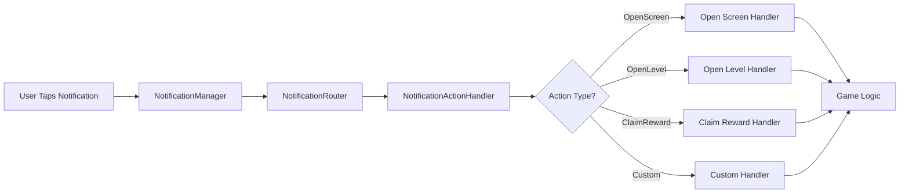

# 🎯 Notification Action Handling & Deep Linking

> 💡 **Hướng dẫn xử lý logic khi người chơi tap vào notification và mở game**

---

## 📖 Tổng Quan

Phần mở rộng này cung cấp hệ thống **Action Handling** và **Deep Linking** cho mobile notifications. Khi người chơi tap vào notification, game có thể:

- 🎮 Mở đúng screen/feature cụ thể
- 🏆 Auto-claim rewards
- 📱 Navigate đến level hoặc event
- 🛒 Mở shop với item được highlight
- ⚙️ Execute custom logic dựa trên notification type

### ⭐ Tính Năng

- ✨ **Action Types**: 10+ built-in action types phổ biến
- 🗺️ **Router System**: Automatic routing notifications đến handlers
- 🔌 **Extensible**: Dễ dàng add custom action types
- 📊 **Event-Driven**: Clean event system cho game integration
- 🎯 **Deep Linking**: Direct navigation đến screens/features
- ⚡ **High Performance**: Async/await patterns với UniTask

---

## 🏗️ Kiến Trúc

### 📂 Cấu Trúc Components Mới

```
MobileNotifications/
├── 💾 Data/
│   └── NotificationAction.cs         # Action data model
├── ⚙️ Core/
│   ├── NotificationActionHandler.cs  # Action processing
│   └── NotificationRouter.cs         # Routing & navigation
└── 📖 Examples/
    ├── NotificationHandling.cs       # Basic handling example
    └── CompleteIntegration.cs        # Full integration example
```

### 🔄 Action Flow



---

## 📖 Action Types Có Sẵn

### 🎯 Built-in Action Types

| Action Type | Description | Use Case |
|---|---|---|
| `OpenScreen` | Mở screen cụ thể | Main menu, settings, etc. |
| `OpenLevel` | Mở level selection với level pre-selected | Continue playing |
| `OpenShop` | Mở shop với item highlighted | Special offers |
| `ClaimReward` | Auto-claim reward | Daily rewards, gifts |
| `OpenDailyReward` | Mở daily reward screen | Daily login |
| `OpenAchievements` | Mở achievements screen | Achievement unlocked |
| `OpenEvent` | Mở event cụ thể | Limited events |
| `OpenProfile` | Mở profile screen | Player stats |
| `StartLevel` | Start gameplay ngay với level | Quick play |
| `CustomAction` | Custom logic của bạn | Anything else |

---

## 💻 Cách Sử Dụng

### 🚀 Setup Cơ Bản

#### 1️⃣ Tạo NotificationRouter trong Scene

```
📁 Hierarchy Window
└── Right-click → Create Empty → Rename: "NotificationRouter"
```

**Add Component:**
```
🎮 Select: NotificationRouter GameObject
➕ Add Component → NotificationRouter
```

**Configure:**
- ✅ **Enable Debug Logs**: `true` (development)
- ⏱️ **Action Delay Ms**: `500` (delay trước khi execute)
- 🖼️ **Loading Screen**: Assign loading screen GameObject (optional)

#### 2️⃣ Tạo Script để Handle Actions

> 📄 **Example**: [`Examples/NotificationHandling.cs`](./Examples/NotificationHandling.cs)

```csharp
using UnityEngine;
using Foundations.MobileNotifications.Core;
using Foundations.MobileNotifications.Interfaces;

public class GameNotificationHandler : MonoBehaviour
{
    [SerializeField] 
    private MobileNotificationManager notificationManager;
    
    [SerializeField] 
    private NotificationRouter notificationRouter;

    private void OnEnable()
    {
        // Subscribe to manager events
        this.notificationManager.OnNotificationReceived += this.HandleNotification;
        
        // Subscribe to router events
        this.notificationRouter.OnOpenScreen += this.HandleOpenScreen;
        this.notificationRouter.OnOpenLevel += this.HandleOpenLevel;
        this.notificationRouter.OnClaimReward += this.HandleClaimReward;
        // ... subscribe to other events
    }

    private void OnDisable()
    {
        // Unsubscribe để tránh memory leaks
        this.notificationManager.OnNotificationReceived -= this.HandleNotification;
        this.notificationRouter.OnOpenScreen -= this.HandleOpenScreen;
        // ... unsubscribe others
    }

    private async void HandleNotification(NotificationData notification)
    {
        // Route notification tự động
        await this.notificationRouter.RouteNotificationAsync(notification);
    }

    private void HandleOpenScreen(string screenName)
    {
        Debug.Log($"📱 Opening screen: {screenName}");
        // Implement your screen navigation
        // Example: SceneManager.LoadScene(screenName);
    }

    private void HandleOpenLevel(string levelId)
    {
        Debug.Log($"🎮 Opening level: {levelId}");
        // Implement your level loading
    }

    private void HandleClaimReward(string rewardId)
    {
        Debug.Log($"🎁 Claiming reward: {rewardId}");
        // Implement reward claiming logic
    }
}
```

---

### 📅 Schedule Notifications với Actions

#### Example 1: Notification Mở Level

```csharp
public async void ScheduleLevelNotification(string levelId)
{
    // Tạo action
    var action = NotificationAction.CreateOpenLevelAction(levelId);
    
    // Tạo notification
    var notification = new NotificationData(
        title: $"🎮 Level {levelId} Awaits!",
        body: "Ready to continue your adventure?",
        fireTimeInSeconds: 3600 // 1 giờ
    );
    
    // Attach action vào notification
    notification.customData = action.ToJson();
    
    // Schedule
    var id = await this.notificationManager.ScheduleNotificationAsync(notification);
    
    Debug.Log($"✅ Scheduled: #{id}");
}
```

#### Example 2: Notification Claim Reward

```csharp
public async void ScheduleRewardNotification(string rewardId)
{
    var action = NotificationAction.CreateClaimRewardAction(rewardId);
    
    var notification = new NotificationData(
        "🎁 Reward Available!",
        "Tap to claim your reward now!",
        60 * 60 * 24 // 1 ngày
    );
    
    notification.customData = action.ToJson();
    
    await this.notificationManager.ScheduleNotificationAsync(notification);
}
```

#### Example 3: Custom Action

```csharp
public async void ScheduleCustomActionNotification()
{
    // Tạo parameters (JSON format)
    var parameters = JsonUtility.ToJson(new 
    { 
        offerId = "special_50", 
        discount = 50,
        expiryDate = "2024-12-31"
    });
    
    // Tạo custom action
    var action = NotificationAction.CreateCustomAction("special_offer", parameters);
    
    var notification = new NotificationData(
        "💰 Special Offer!",
        "50% OFF all items! Limited time!",
        60 * 60 * 6 // 6 giờ
    );
    
    notification.customData = action.ToJson();
    
    await this.notificationManager.ScheduleNotificationAsync(notification);
}
```

---

### 🎯 Handle Custom Actions

#### Đăng Ký Custom Handler

```csharp
private void Start()
{
    // Register custom handler cho specific action type
    this.notificationRouter.RegisterCustomHandler(
        NotificationActionType.CustomAction,
        this.HandleMyCustomAction
    );
}

private async UniTask<bool> HandleMyCustomAction(
    NotificationAction action, 
    NotificationData notification)
{
    Debug.Log($"⚙️ Custom action: {action.targetId}");
    
    // Parse parameters
    var parameters = action.parameters;
    
    // Execute your logic
    switch (action.targetId)
    {
        case "special_offer":
            this.ShowSpecialOffer(parameters);
            break;
            
        case "tournament":
            await this.JoinTournamentAsync(parameters);
            break;
            
        default:
            Debug.LogWarning($"Unknown action: {action.targetId}");
            return false;
    }
    
    return true;
}
```

---

### 📱 Deep Linking Examples

#### Example 1: Direct Navigation đến Level

```csharp
// Khi player complete level, schedule notification cho next level
public async void OnLevelCompleted(int levelNumber)
{
    var nextLevel = levelNumber + 1;
    
    // Tạo action để start level ngay khi tap
    var action = NotificationAction.CreateStartLevelAction(nextLevel.ToString());
    
    var notification = new NotificationData(
        $"▶️ Ready for Level {nextLevel}?",
        "Tap to start playing immediately!",
        60 * 60 * 2 // 2 giờ
    );
    
    notification.customData = action.ToJson();
    
    await this.notificationManager.ScheduleNotificationAsync(notification);
}

// Handle trong router
private void HandleStartLevel(string levelId)
{
    // Load gameplay scene
    SceneManager.LoadScene("Gameplay");
    
    // Auto-start level
    PlayerPrefs.SetString("auto_start_level", levelId);
}
```

#### Example 2: Deep Link vào Shop với Item

```csharp
public async void ScheduleShopNotification(string itemId, string itemName)
{
    var action = NotificationAction.CreateOpenShopAction(itemId);
    
    var notification = new NotificationData(
        $"🛒 {itemName} On Sale!",
        "Limited time offer! Buy now!",
        60 * 60 * 12 // 12 giờ
    );
    
    notification.customData = action.ToJson();
    
    await this.notificationManager.ScheduleNotificationAsync(notification);
}

// Handle
private void HandleOpenShop(string itemId)
{
    // Load shop scene
    SceneManager.LoadScene("Shop");
    
    // Highlight specific item
    PlayerPrefs.SetString("shop_highlight_item", itemId);
}
```

#### Example 3: Event Deep Linking

```csharp
public async void ScheduleEventNotifications(string eventId, string eventName)
{
    // Event start notification
    var startAction = NotificationAction.CreateOpenEventAction(eventId);
    var startNotification = new NotificationData(
        $"🎉 {eventName} Started!",
        "Join now and win rewards!",
        60 // 1 phút
    );
    startNotification.customData = startAction.ToJson();
    await this.notificationManager.ScheduleNotificationAsync(startNotification);
    
    // Event ending soon
    var endAction = NotificationAction.CreateOpenEventAction(eventId);
    var endNotification = new NotificationData(
        $"⏰ {eventName} Ending Soon!",
        "Last chance! Only 1 hour left!",
        60 * 60 * 23 // 23 giờ
    );
    endNotification.customData = endAction.ToJson();
    await this.notificationManager.ScheduleNotificationAsync(endNotification);
}
```

---

## 🎮 Use Cases Thực Tế

### 1️⃣ Daily Login Flow

```csharp
// Khi player thoát game
public async void OnPlayerLogout()
{
    // Schedule daily reward notification
    var action = NotificationAction.CreateOpenDailyRewardAction();
    
    var notification = new NotificationData(
        "🎁 Daily Reward Ready!",
        "Don't miss your daily bonus!",
        60 * 60 * 24 // 1 ngày
    );
    
    notification.customData = action.ToJson();
    
    await this.notificationManager.ScheduleNotificationAsync(notification);
}

// Handle khi player tap notification
private void HandleOpenDailyReward()
{
    // Load main menu
    SceneManager.LoadScene("MainMenu");
    
    // Auto-open daily reward popup
    PlayerPrefs.SetInt("show_daily_reward", 1);
}
```

### 2️⃣ Energy Refill Reminder

```csharp
public async void OnEnergyDepleted()
{
    // Calculate energy refill time
    var refillTime = this.GetEnergyRefillTimeInSeconds();
    
    // Create custom action
    var parameters = JsonUtility.ToJson(new { energyAmount = 5 });
    var action = NotificationAction.CreateCustomAction("energy_refill", parameters);
    
    var notification = new NotificationData(
        "⚡ Energy Refilled!",
        "Your energy is full! Come back and play!",
        refillTime
    );
    
    notification.customData = action.ToJson();
    
    await this.notificationManager.ScheduleNotificationAsync(notification);
}

// Handle custom action
private async UniTask<bool> HandleEnergyRefill(
    NotificationAction action, 
    NotificationData notification)
{
    // Grant energy to player
    var data = JsonUtility.FromJson<EnergyData>(action.parameters);
    this.playerStats.AddEnergy(data.energyAmount);
    
    // Navigate to gameplay
    SceneManager.LoadScene("Gameplay");
    
    return true;
}
```

### 3️⃣ Achievement Unlock Celebration

```csharp
public async void OnAchievementUnlocked(string achievementId, string achievementName)
{
    // Immediate congratulations
    var congratsAction = NotificationAction.CreateOpenAchievementsAction();
    var congratsNotification = new NotificationData(
        "🏆 Achievement Unlocked!",
        $"Congratulations on '{achievementName}'!",
        60 * 5 // 5 phút
    );
    congratsNotification.customData = congratsAction.ToJson();
    await this.notificationManager.ScheduleNotificationAsync(congratsNotification);
    
    // More achievements reminder
    var moreAction = NotificationAction.CreateOpenAchievementsAction();
    var moreNotification = new NotificationData(
        "🎯 More Achievements Await!",
        "Can you unlock them all?",
        60 * 60 * 6 // 6 giờ
    );
    moreNotification.customData = moreAction.ToJson();
    await this.notificationManager.ScheduleNotificationAsync(moreNotification);
}
```

---

## ⚙️ Advanced Features

### 🔧 Loading Screen Integration

Router hỗ trợ tự động show/hide loading screen khi process actions:

```csharp
// Trong action setup
var action = NotificationAction.CreateOpenLevelAction("5");
action.showLoading = true;
action.loadingMessage = "Loading Level 5...";

notification.customData = action.ToJson();

// Router sẽ tự động:
// 1. Show loading screen trước khi execute
// 2. Execute action
// 3. Hide loading screen sau khi complete
```

### 📊 Action Priority

Actions có thể có priority để xử lý đúng thứ tự:

```csharp
var action = NotificationAction.CreateClaimRewardAction("daily_reward");
action.priority = 10; // Higher priority = process first

// Useful khi có nhiều notifications cùng lúc
```

### 🎯 Action Callbacks

Monitor action execution với callbacks:

```csharp
private void SetupActionCallbacks()
{
    var handler = this.notificationRouter.GetActionHandler();
    
    handler.SetOnActionStarted((action) =>
    {
        Debug.Log($"⏳ Action started: {action.actionType}");
    });
    
    handler.SetOnActionCompleted((action, success) =>
    {
        Debug.Log($"✅ Action {(success ? "completed" : "failed")}");
    });
    
    handler.SetOnActionError((action, error) =>
    {
        Debug.LogError($"❌ Action error: {error}");
    });
}
```

---

## 🔍 Debugging & Testing

### Enable Debug Logs

```csharp
// Trong NotificationRouter Inspector
Enable Debug Logs = true

// Bạn sẽ thấy logs như:
// 🗺️ [NotificationRouter] Routing notification: Title
// 📱 [NotificationRouter] Opening screen: main_menu
// ✅ [NotificationRouter] Action completed: OpenScreen
```

### Test Actions trong Editor

```csharp
[ContextMenu("Test Open Level Action")]
private void TestOpenLevelAction()
{
    var action = NotificationAction.CreateOpenLevelAction("5");
    var notification = new NotificationData("Test", "Test Body", 0);
    notification.customData = action.ToJson();
    
    // Manually trigger
    this.notificationRouter.RouteNotificationAsync(notification).Forget();
}
```

---

## 📋 Best Practices

### ✅ Do - Nên Làm

1. **Always Unsubscribe Events**
```csharp
private void OnDisable()
{
    // Cleanup để tránh memory leaks
    this.notificationRouter.OnOpenScreen -= this.HandleOpenScreen;
}
```

2. **Validate Action Data**
```csharp
if (action != null && action.IsValid())
{
    await this.ExecuteAction(action);
}
```

3. **Use Descriptive Action IDs**
```csharp
// ✅ Good
var action = NotificationAction.CreateCustomAction("vip_offer_50_percent");

// ❌ Bad
var action = NotificationAction.CreateCustomAction("a1");
```

4. **Handle Errors Gracefully**
```csharp
try
{
    await this.notificationRouter.RouteNotificationAsync(notification);
}
catch (Exception ex)
{
    Debug.LogError($"Routing error: {ex.Message}");
    // Show error message to user
}
```

### ❌ Don't - Tránh

1. **Đừng Block Main Thread**
```csharp
// ❌ Bad - blocking
var result = this.ExecuteActionAsync().Result;

// ✅ Good - async
await this.ExecuteActionAsync();
```

2. **Đừng Hardcode Screen Names**
```csharp
// ❌ Bad
HandleOpenScreen("MainMenu");

// ✅ Good - use constants
public static class ScreenNames
{
    public const string MainMenu = "MainMenu";
    public const string Gameplay = "Gameplay";
}

HandleOpenScreen(ScreenNames.MainMenu);
```

3. **Đừng Quên Check Permission**
```csharp
// ✅ Always check
if (!this.notificationManager.HasPermission)
{
    Debug.LogWarning("No permission!");
    return;
}
```

---

## 🎓 Tóm Tắt

### ✅ Key Points

1. 🎯 **NotificationAction**: Data model chứa action info
2. 🗺️ **NotificationRouter**: Route và execute actions
3. 🔌 **Event System**: Clean integration với game code
4. 📱 **Deep Linking**: Direct navigation đến features
5. ⚙️ **Extensible**: Dễ add custom actions
6. 🎮 **Built-in Types**: 10+ action types có sẵn

### 🚀 Quick Start Checklist

- [ ] ✅ Add NotificationRouter vào scene
- [ ] ✅ Subscribe to router events
- [ ] ✅ Implement action handlers
- [ ] ✅ Create actions và attach vào notifications
- [ ] ✅ Test routing flow
- [ ] ✅ Handle errors gracefully

---

> 💡 **Với hệ thống này, bạn có thể tạo notification flow phức tạp với deep linking và custom actions!**

> 📧 **Questions?** Check [`Examples/`](./Examples/) folder để xem full implementations!

---

**Version**: 1.1.0  
**Last Updated**: 2024-01-20  
**Requires**: Mobile Notifications System v1.0.0+

